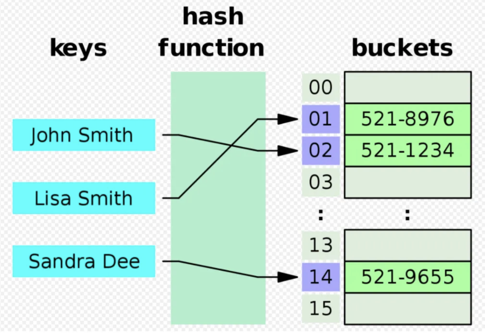

# Index

RDBMS에서 성능을 향상시킬 수 있는 대표적인 방법중에 하나이다.
검색 속도 향상을 목적으로 만드는 하나 이상의 테이블 필드에 대한 자료구조이다.
MySQL에서는 인덱스를 크게 클러스터형 인덱스와 세컨더리 인덱스(논클러스터형 인덱스)로 나뉜다.

## 클러스터형 인덱스
테이블당 하나씩 만들 수 있는 인덱스로, 우리가 사용하는 기본 키를 통해 클러스터형 인덱스가 생성된다.
만약 기본 키가 지정된 필드가 없는 경우에는 NOT NULL 제약조건과 UNIQUE 제약 조건이 있는 필드를 클러스터형 인덱스로 간주한다.

## 세컨더리 인덱스(논클러스터형 인덱스)

세컨더리 인덱스는 테이블당 여러개가 존재할 수 있으나 클러스터형 인덱스보다 일반적으로 느리다.


## 문법
```mysql
# 테이블 이름의 필드에 세컨더리 인덱스인 인덱스 이름 설정
CREATE INDEX index_name ON Table_name(field);

# 인덱스 조회
SHOW INDEX FROM Table_name;

# 인덱스 삭제
DROP INDEX index_name FROM Table_name;

```

## INDEX 자료 구조
인덱스의 자료 구조는 주로 해시테이블과 B 트리 자료구조를 통해 구현된다.

### 해시 인덱스
키 - 값 형태로 저장되지만 해쉬의 키 값은 해싱 함수를 통해 생성된다.
키 값 자체가 데이터를 저장하는 배열의 인덱스가 되기 때문에 키에 대한 밸류값으로 저장된 위치를 빠르게 가져올 수 있다.
일반적으로 O(1)의 시간 복잡도를 갖는다.
해시 함수를 사용하기 때문에 범위 검색이 어렵다. 범위 검색을 하려면 모든 해시 값에 대해 순차적으로 탐색해야 한다.
일반적으로 비트리 인덱스보다 작은 크기를 갖는다. 하지만 해시 충돌이 발생할 경우 공간 효율성이 저하 될 수 있다.
값이 정확해야 하는 경우 유용하다. 고유 식별자를 가진 테이블에 경우 적합하다.


### B-tree 인덱스

최대 2개의 자식 노드만을 가지는 이진탐색트리를 일반화하여 2개 이상의 자식 노드를 가지도록 확장한 균형 트리
이진 탐색 트리와는 달리 균형을 유지하며, 각 노드의 자식은 키 값에 대한 범위를 갖는다.
검색 시 루트부터 시작하여 트리를 탐색하여 원하는 키를 갖는다.
일반적으로 O(log n)의 시간 복잡도를 갖는다.
범위 검색에 효과적이다. 각 노드가 키 값에 대한 범위를 갖기 때문에 범위 검색 시에도 효율적으로 데이터를 찾을 수 있다.
해쉬 인덱스보다 큰 크기를 가질 수 있다.
범위 검색이나 정렬된 데이터에 대해 검색이 필요한 경우 유용하다.


### 비트리 인덱스가 더 범용적으로 사용되는 이유

평균적으로 O(logN)의 빠른 성능으로 탐색, 삽입, 수정, 삭제를 할 수 있으며, 정렬이 되어 있기 때문에 부등호 >, <와 같은 범위 탐색에 효율적 접근이 가능하다.
노드마다 배열로 구현되어 있어 참조 포인터를 통해 방대한 데이터 접근에 더 적합하다.

## 인덱스를 사용해야 하는 경우

인덱스는 테이블에 3개 정도 생성하는 것이 좋다. 너무 많은 인덱스를 생성하는 경우 저장 공간과 생성 시간을 많이 할애한다는 단점도 있기 때문이다.
인덱스는 조회 성능은 향상 시킬 수 있지만, 그 외의 작업에 대해서는 성능을 오히려 저하 시킬 수 있다.
데이터가 충분히 많지 않은 상황에서는 굳이 인덱스를 사용할 필요가 없다. 또한 조회 연산이 적은 경우에도 굳이 사용할 필요가 없다.
충분히 많은 데이터에서 조회가 빈번히 이루어지는 테이블이 있는 경우 활용하는 것이 좋다.
다시 말해, SELECT문 중에서도 자주 조인되거나 WHERE, ORDER BY에서 자주 언급되는 필드가 인덱스로 활용된다.
