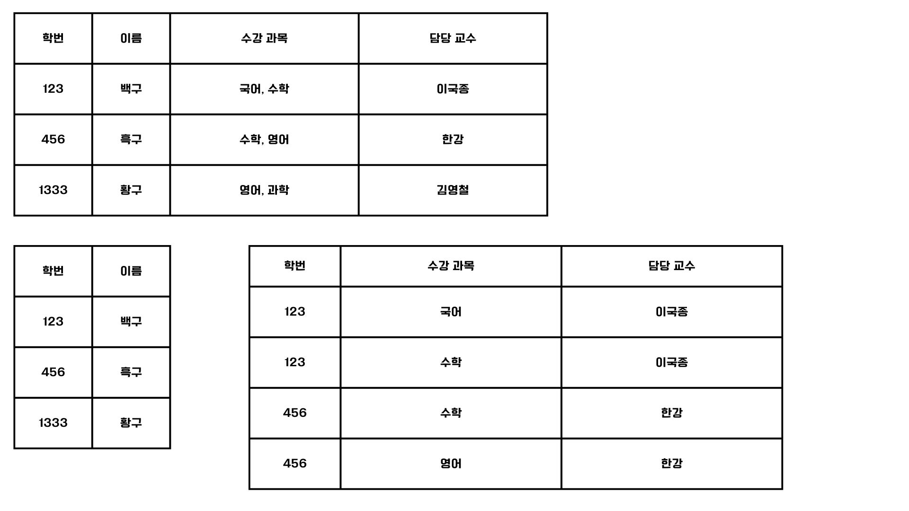
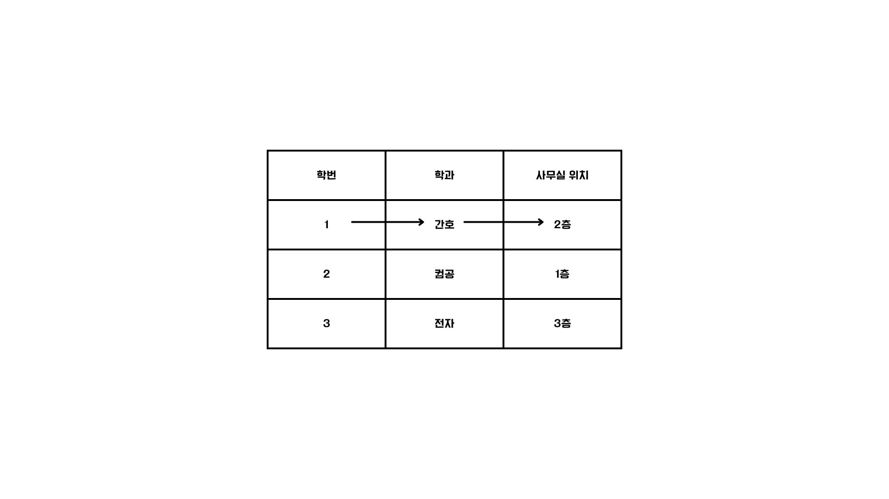

# 정규화(Normal Form, NF)

정규화란 잠재적인 문제가 발생하지 않도록 테이블의 필드를 구성하고, 필요한 경우 테이블을 나누는 작업을 수행한다.
정규형의 종류로는 제1 정규형~3정규형, 보이스/코드 정규형, 제4 정규형, 제5 정규형이 있다.
대부분의 경우 제3정규형 또는 보이스/코드 정규형까지만 수행된다.

## 제1 정규형
모든 속성이 원자 값을 가진다.
더 이상 쪼개질 수 없는 값을 필드 데이터로 가져야 한다.
하나의 컬럼에 값이 두 개 이상 들어있는 경우 중복되는 레코드를 감수하고 하나의 테이블에서 쪼개는 방법과 여러 개의 테이블로 쪼개는 방법이 있다.

## 제2 정규형

제1 정규형을 만족함과 동시에, 기본 키가 아닌 모든 필드들이 모든 기본 키에 완전히 종속되는 조건을 갖춘 상태를 말한다.
보통 기본 키가 2개 이상인 복합키를 갖춘 필드에서 고려된다.
기본 키의 일부에만 종속되는 필드가 있다면, 이를 제거해서 기본키 전체에 종속되도록 필드를 구성해야 한다.
테이블의 모든 필드가 기본 키에 완전히 종속되어야 하고 일부 기본키에만 종속되어서는 안된다는 조건이 제2 정규형이다.

### 결정자와 종속자

어떠한 필드A의 값을 통해 특정 필드B의 유일성을 갖춘 값이 결정되는 경우 B가 A에 대해 종속적이다라고 표현한다.
이는 자바에서 객체에 대한 의존성을 가지는 것과 동일한 의미이다.
이때 A는 결정자, B는 종속당하기에 종속자라고 한다.

### 함수 종속성

기본 키가 아닌 필드가 기본 키의 일부에 종속되어 있는 경우 `부분 함수 종속성`,
기본 키 전체에 완전히 종속되어 있는 경우 `완전 함수 종속성`이 있다고 표현한다.
다른 말로 `부분 함수 종속성`이 없는 상태, 후보 키에 속하지 않는 모든 필드가 기본 키에 완전 함수 종속인 상태라고 할 수 있다.

## 제3 정규형

제2 정규형을 만족하면서, 기본 키가 아닌 모든 필드가 기본 키에 이행적 종속성이 없는 상태를 의미한다.

### 이행적 종속성
A가 B를 결정하고, B가 C를 결정한다면 A도 C를 결정할 수 있는 종속 관계를 형성한다. A와 C 사이에는 이행적 종속 관계,이행 함수 종속성이 있다고 표현한다.

학번이 학과를 결정하고 학과가 학과 사무실 위치를 결정하는 이행적 종속 관계를 위 이미지에서 확인할 수 있다.
물론 학과 사무실은 하나만 존재한다는 가정 하에 설정하였다.

이러한 이행적 종속 관계를 없애기 위해 테이블을 학번-학과 , 학과-학과 사무실 위치로 쪼개게 되면 제3 정규형을 만족한다.

## 보이스/코드 정규형
제3 정규형을 만족하는 동시에 모든 결정자가 후보 키여야 한다는 조건이다.
키가 아니더라도 해당 컬럼이 결정자 역할을 한다면 별도의 테이블로 분리를 해야 한다.

## 역정규화
항상 정규화를 한다고 올바른 방법인것은 아니다.
정규화를 하다보면 테이블을 여러개로 분리하기 때문에 테이블이 많아지면 자연스럽게 조인 연산이 늘어나며, 다른 테이블을 참조하기 위해 성능상 비용이 늘어날 수 밖에 없다.
정규화를 하게 되면 데이터를 깔끔하게 분리하고 정리할 수 있지만, 오히려 성능을 저해할 수 있는 상황도 발생한다.
최대한 정규화의 이점을 활용하기 위해서 데이터의 중복, 삽입/수정/삭제 연산에서 번거로움을 감수해서라도 하나의 테이블로 관리하기도 한다.
이런 이유에서 NoSQL은 기본적으로 정규화를 수행하지 않는다.
이렇게 분할되어 있는 테이블을 하나로 합치는 작업을 역정규화라고 한다.

