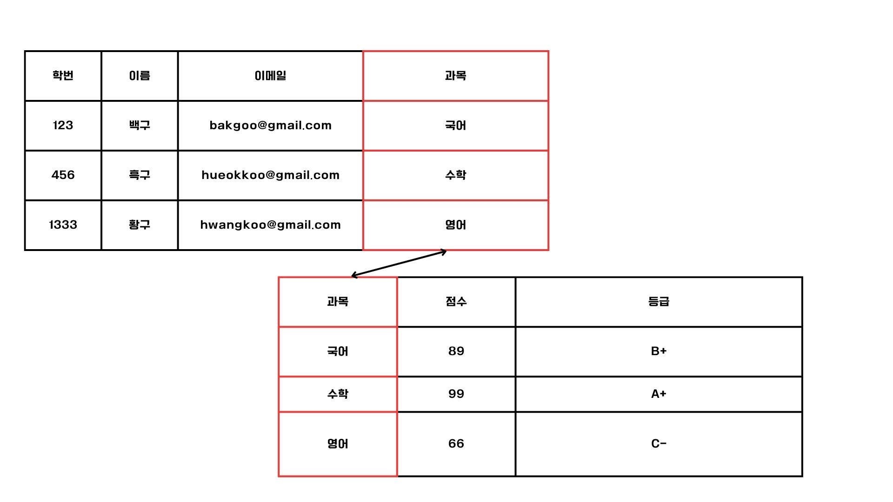

# RDBMS

## 테이블 구성

RDBMS 내의 레코드들은 테이블의 형태를 이룬다.
각 필드로 사용가능한 데이터 유형들이 정해져 있으며 이를 `필드타입` 이라고 한다. 
테이블 내의 특정 레코드를 식별할 수 있는 필드의 집합은 `키`라고 한다. 
`키`는 레코드의 식별뿐만 아니라 테이블 간 참조할때에도 사용된다.

## 키

테이블에서 특정 레코드를 식별할 수 있는 하나 이상의 필드를 키라고 한다.
키는 다양한 종류가 있으며 이를 모두 암기하지 않아도 되지만 `후보 키`, `기본 키`, `외래 키`정도는 알고 있어야 한다.

`후보키`는 테이블의 한 레코드를 식별하기 위한 필드의 최소한의 집합이다.
특정 레코드를 유일하기 식별한다는 점으로 `유일성`을 갖추고 있다고 한다.
하나 이상의 필드로 구성될 수 있으며, 후보 키에 포함된 필드 중 하나라도 생략하면 레코드를 고유하게 식별할 수 없다.
불필요한 필드가 키에 포함되어 있지 않고, 최소한의 정보로 레코드를 식별한다는 점에서 `최소성`을 갖추고 있다고 한다.
유일성을 갖는 학번, 이메일은 후보키가 될 수 있다. 이름은 동일인물이 있을 수 있기 때문에 유일성을 갖추기 어렵다.
이렇게 2개 이상의 필드로 레코드를 식별 가능한 후보키가 있을 때 `복합 키`라고 부른다.

`슈퍼 키`는 레코드를 식별하기 위한 필드의 최소 집합이 아니라 레코드를 식별하기 위한 필드의 집합이다.
유일성만 만족하고 최소성은 만족하지 않는것이다. 슈퍼키에는 레코드 식별에 꼭 필요하지 않은 필드도 포함될 수 있다.

`기본 키`는 한 레코드를 식별하도록 선정되어 테이블당 하나만 존재할 수 있는 키를 말한다.
여러 후보 키 중에서 테이블의 레코드를 대표하도록 선택한 키다.
후보 키의 일부이기 때문에 `유일성`과`최소성`을 모두 만족하며, 여러 필드로 구성된 기본 키도 존재할 수 있다.
만약 값이 존재하지 않는다면 `NULL` 로 표기한다. 하지만 기본 키는 NULL을 가질 수 없다. 
다시 정리하면 중복된 값이 없는 `유일성`, 최소한의 정보를 갖는 `최소성`, 값이 반드시 존재해야 하는 속성을 지니고 있어야한다.

`후보 키`중 `기본 키`가 아닌 것들은 `후보 키`라고 한다.

`외래 키`는 다른 테이블의 기본 키를 참조하는 필드로, 테이블 간의 참조 관계를 형성할 때 사용하는 키이다.

위 테이블의 과목은 아래 과목테이블의 과목 컬럼을 외래키로 참조하여 가져온것이다. 외래 키를 통해 다른 테이블에 연결이 가능하고, 테이블 간의 관계또 표현할 수 있다.

## 무결성 제약 조건

`무결성`이란 일관되며 유효한 데이터의 상태를 말한다. 다시말해, 무결성 제약 조건이란 데이터베이스에 저장된 데이터의 일관성과 유효성을 유지하기위해 지켜야할 조건들을 말한다.
무결성을 지키기 위한 조건에는 4가지가 있다.

- 도메인 제약 조건
  - 테이블이 가질 수 있는 필드 타입과 범위에 대한 규칙이다.
  - 각각의 필드 데이터는 원자값을 가져야 하고, 지정된 필드 타입을 준수해야 한다.
  - 값의 범위나 기본값이 지정되어 있는 경우에는 그를 따라야하고 NULL이 허용되지 않았다면 NULL로 저장해서는 안된다.

`원자성`이란 더 이상 쪼갤 수 없는 단일한 값을 말하며 테이블에서는 각 필드의 단일 값들을 말한다.
만약 컬럼이 이름, 나이, 성별이 아닌 이름과 나이와 성별이라고 하여 Hong,25,남 이렇게 데이터가 들어가 있을 경우에는 원자성을 지닌 값이라고 할 수 없다.

- 키 제약 조건
  - 레코드를 고유하게 식별할 수 있는 키로 지정된 필드에 중복된 값이 존재해선 안된다.

- 엔티티 무결성 제약 조건
  - 기본 키로 지정한 필드는 고유한 값이어야 하며, NULL이 되어서는 안된다.
- 참조 무결성 제약 조건
  - 외래 키를 토앻 다른 테이블을 참조할 떄 데이터의 일관성을 지키기 위한 제약 조건으로, 외래 키는 참조하는 테이블의 기본 키와 같은 값을 갖거나 NULL값을 가져야 한다는 규칙이다.

## 만약 참조하는 테이블이 삭제/수정되는 경우

기존에 참조하던 테이블의 값이 변경되거나 삭제되는 경우 어떠한 조치를 취할 수 있을까?
1. 연산 제한
   - 주어진 수정 및 삭제 연산 자체를 거부한다.
2. 기본값 설정
   - 기존에 설정한 기본값으로 해당 데이터를 수정한다.
3. NULL값 설정
    - 참조하는 레코드를 NULL로 설정한다.
4. 연쇄 변경
   - 참조하는 레코드도 함께 수정하거나 삭제되도록 연쇄적으로 작동되도록 설정한다.

