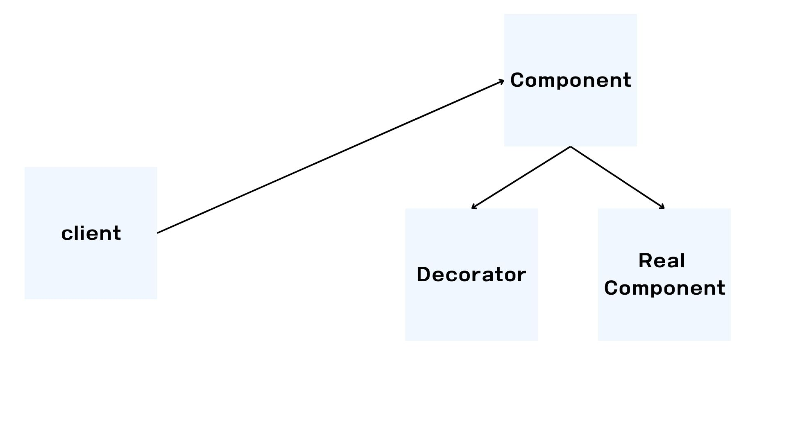

# Decorator

데코레이터 패턴은 프록시 패턴을 사용해서 부가 기능을 추가하는 것을 목적으로 하고 있다.



```java

public interface Component {
    String operation();
}

@Slf4j
public class RealComponent implements Component {
    @Override
    public String operation() {
        log.info("RealComponent 실행");
        return "data";
    }
}


@Slf4j
public class DecoratorClient {
    private Component component;

    public DecoratorClient decoratorClient(Component component) {
        this.component = component;
    }

    public void execute() {
        String result = component.operation();
        log.info("result={}", result);
    }
}

@Sl4fj
public class Decorator implements Component {
    private Component component;

    public Decorator decorator(Component component) {
        this.component = component;
    }

    @Override
    public String operation() {
        log.info("Decorator 실행");
        String result = component.operation();
        String decoResult = "______" + result + "_______";
        log.info("Decorator 꾸미기 적용 전 = {} , 적용 후 " , result , decoResult);
        return decoResult;
    }
}
```

Decorator는 Compoenet 인터페이스를 구현하며 프록시가 호출해야 하는 대상을 Compoenent에 저장한다.
operation을 호출하게 되면 프록시와 연결된 대상을 호출하여 그 응답 값에 부가기능을 더한 값을 반환한다.

## Decorator vs Proxy 패턴

두 기능은 시스템 자체가 매우 유사하다. 하지만 그 의도에 따라 나뉘었다는게 중요한 점이다.
프록시 패턴 : 다른 객체에 대한 접근을 제어하기위한 대리자 역할 수행
데코레이터 패턴 : 객체에 추가 기능을 동적으로 추가하고, 기능 확장을 유연하게 수행 가능