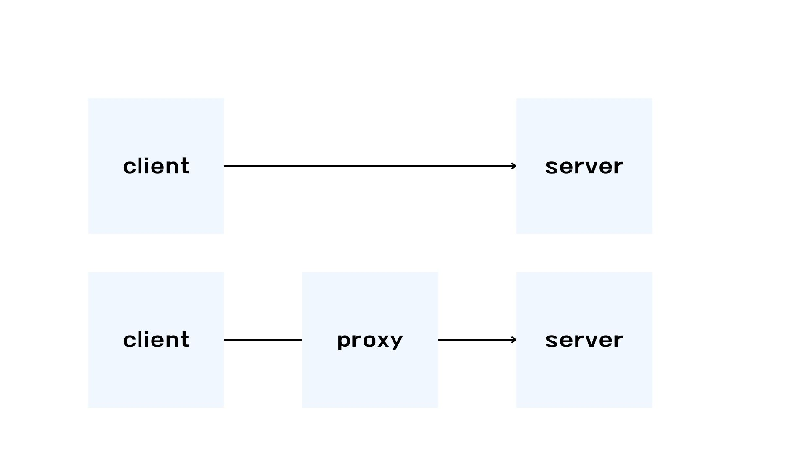
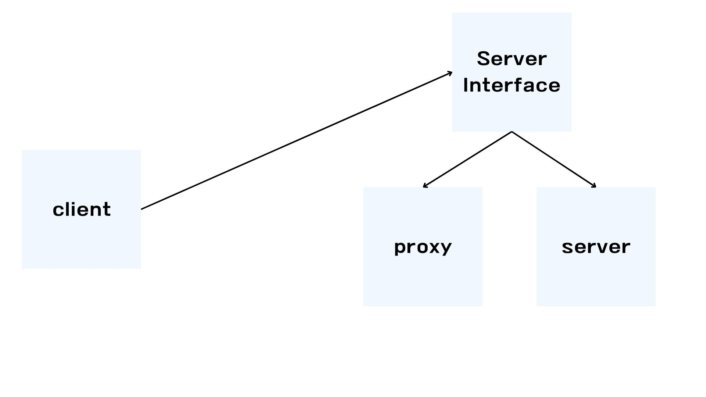

# Proxy

클라이언트가 서버를 직접 호출하고 처리 결과를 반환받는다.
클라이언트가 요청한 결과를 서버에서 직접 요청하는 것이 아니라 어떤 대리자를 통해서 대신 간접적으로 서버에서 요청할 수 있다.
이 대리자를 프록시라고 칭한다. 객체에서 프록시가 되려면 서버에서 요청을 한 것인지, 클라이언트가 사용하는 서버 객체를 프록시 객체로 변경해도 클라이언트 코드를 변경하지 않고 동작할 수 있어야 한다.

# Proxy의 주요 기능

- 접근 제어
  - 인가
  - 캐싱
  - 지연로딩
- 부가 기능
    - 로깅
    - 요청 값 또는 응답 값을 중간에서 변환


## GOF 디자인 패턴
의도에 따라 프록시 패턴과 데코레이터 패턴으로 구분한다.
프록시 패턴은 접근 제어가 목적이며 데코레이터 패턴은 새로운 기능 추가가 목적이다.



```java
public interface Subject {
    String operation();
}

@Slf4j
public class RealSubject implements Subject {
    @Override
    public String operation() {
                log.info("실제 객체를 호출");
                sleep(1000);
        return "data";
    }
    
    private void sleep(int millis){
        try {
                    Thread.sleep(millis);
        } catch (InterruptedException e) {
                    e.printStackTrace();
        }
    }
}
```

```java
import javax.security.auth.Subject;

public class ProxyPatternClient {
    private Subject subject;

    public ProxyPatternClient(Subject subject){
                this.subject = subject;
    }
    
    public void process(){
                subject.operation();
    }
    
}
```
```java
@Slf4j
public class CacheProxy implements Subject{
    private Subject subject;
    private String cacheValue;
    
    public CacheProxy(Subject subject){
                this.subject = subject;
    }
    
    @Override
    public String operation(){
                log.info("프록시 호출");
        if (cacheValue == null) {
                    cacheValue = suject.operation();
        }
        return cacheValue;
    }
}
```

클라이언트가 프록시를 호출하면 프록시가 최종적으로 실제 객체를 호출해야 한다.
그래서 따로 내부에 실제 객체를 참조하고 있어야 한다. CacheProxy에서는 이전에 저장해둔 cacheValue가 없으면 실제 객체를 호출하여 저장하고, 이미 저장되어 있다면 캐싱값을 사용한다.

이 패턴의핵심은 RealSubject코드와 클라이언트 코드를 변경하지 않고, 프록시를 도입해서 접근을 제어할 수 있다는 점이다.
실제 클라이언트 입장에서는 프록시 객체가 주입되었는지, 실제 객체가 주입되었는지는 알지 못한다.

