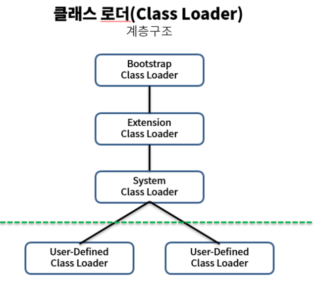

# JVM

## JVM이란?

JVM은 자바 바이트코드를 운영체제에 맞는 기계어로 변환하여 실행하는 역할이다. 운영체제와 독립적으로 수행이 가능하다.

## JVM 실행 과정

JVM은 자바 바이트코드를 운영체제에 맞는 기계어로 변환하여 실행하는 역할을 한다.
1. 자바 소스 코드는 먼저 바이트코드로 컴파일된다.
   - 이때 나오는 파일은 운영체제가 읽을 수 없으며 자바 가상머신이 이해할 수 있는 코드이다.
2. ClassLoader가 클래스를 로드한다.
   - 세부 동작
     - 로드 : 파일을 가져와서 JVM의 메모리에 로드한다.
     - 검증 : 자바 언어 명세 및 JVM 명세에 명시된 대로 구성되어 있는지 검사한다.
     - 준비 : 클래스가 필요로 하는 메모리를 할당합니다. (필드, 메서드, 인터페이스 등등)
     - 분석 : 클래스의 상수 풀 내 모든 심볼릭 레퍼런스를 다이렉트 레퍼런스로 변경한다.
     - 초기화 : 클래스 변수들을 적절한 값으로 초기화한다.
3. 실행엔진은 JVM 메모리에 올라온 바이트 코드들을 명령어 단위로 하나씩 가져와서 실행한다. 이때, 실행 엔진은 두가지 방식으로 변경하는데 JIT 컴파일러와 인터프리터 방식이다.

### 부트스트랩 클래스 로더
  - 최상위 클래스로더로 유일하게 JAVA가 아니라 네이티브 코드로 구현이 되어있다.
  - JVM이 실행될 때 같이 메모리가 올라간다
  - Object 클래스를 비롯하여 JAVA API들을 로드한다.
### 익스텐션 클래스 로더
  - 기본 jAVA API를 제외한 확장 클래스들을 로드한다. (다양한 보안 확장기능 로드)

### 시스템 클래스 로더
  - 부트스트랩, 익스텐션 클래스로더가 jVM 자체의 구성요소들을 로드한다면, 시스템 클래스 로더는 어플리케이션의 클래스들을 로드한다.
  - 사용자가 지정한 $ClassPath 내의 클래스들을 로드한다.

### 사용자 정의 클래스 로더
  - 애플리케이션 사용자가 직접 코드상에서 생성하여 사용하는 클래스 로더

> WAS와 같은 프레임워크는 웹 어플리케이션, 엔터프라이즈 어플리케이션이 서로 독립적으로 동작하게 하기 위해서 사용자 정의 클래스 로더들을 사용하여 클래스 로더의 위임 모델을 통해 어플리케이션의 독립성을 보장한다.

### 인터프리터란?
  - 바이트 코드 명령어를 하나씩 읽어서 해석하고 실행한다. 하나하나의 실행은 빠르나, 전체적인 실행 속도는 느리다는 단점을 가진다.

### JIT 컴파일러란?
자바 애플리케이션에서 자주 사용되는 코드를 미리 컴파일하여 기계어로 변환하고, 이후 해당 코드를 실행할 때 재사용한다.
인터프리터는 한 줄씩 해석하지만 JIT는 코드를 미리 바이트 코드 전체가 컴파일된 바이너리 코드로 변환하기 때문에 성능을 크게 향상시킬 수 있다.

### 바이트 코드란?
바이트 코드는 자바 소스 코드를 컴파일하여 생성되는 중간레벨 코드이다.
JVM이 실행할 수 있도록 설계된 이진 포맷으로, 기계어가 아닌 플랫폼에서 독립적인 명령어의 집합이다.

### 클래스 로더
JVM내에 클래스 파일을 동적으로 로드하고, 링크를 통해 배치하는 작업을 수행하는 모듈이다.
로드된 바이트 코드를 통해 JVM의 메모리 영역인 Runtime Data Area에 배치한다.

### Runtime Data Area

- PC Register
  - 현재 수행중인 명령의 주소를 가지며 스레드가 시작될 때 생성되며 각 스레드마다 하나씩 존재한다.
- Method(Static)영역
  - JVM에서 읽어들인 클래스와 인터페이스에 대한 런타임 상수 풀, 메서드와 필드, static 변수, 메서드 바이트 코드 등을 보관한다.
  - 여기서 Runtime Constant Pool은 클래스와 인터페이스 상수, 메서드와 필드에 대한 모든 레퍼런스를 저장한다.JVM은 런타임 상수 풀을 통해 해당 메서드나 필드의 실제 메모리 상 주소를 찾아 참조한다.
- Heap Area
  - 프로그램상에서 데이터를 저장하기 위해 런타임 시 동적으로 할당하는 사용하는 메모리 영역
  - New 연산자를 통해 생성한 객체, 인스턴스 또는 배열을 저장한다
  - 힙의 참조 주소는 스택이 갖고 있고, 해당 객체를 통해서만 힙 영역에 있는 인스턴스를 핸들링 할 수 있다.
  - GC 대상으로 JVM 성능 등의 이슈에서 가장 많이 언급되는 공간이다. 힙 구성 방식이나 가비지 컬렉션 방법 등은 jVM 벤더들의 재량이다.
- Stack Area
  - 메서드 호출 시 생성되는 스레드 수행정보를 기록하는 Frame저장, 메서드 정보, 지역변수, 매개변수, 연산 중 발생하는 임시 데이터가 저장 된다.
  - 기본 자료형을 생성할 때에도 저장된다.
  - 예외 발생 시 printStackTrace()메서드로 보여주는 Stack Trace의 각 라인 하나가 스택 프레임을 표현한다.
  - JVM 스택 역시 PC Register와 마찬가지로 스레드가 시작될 때 생성되며 각 스레드마다 하나씩 존재한다.
- Runtime Constant Pool
  - JVM 동작에서 가장 핵심적인 역할로 JVM명세에서도 따로 중요하게 기술한다. 각 클래스와 인터페이스의 상수뿐만 아니라, 메서드와 필드에 대한 모든 레퍼런스까지 담고 있는 테이블이다.
  - 어떤 메서드나 필드를 참조할때 JVM은 런타임 상수 풀을 통해 해당 메서드나 필드의 실제 메모리상 주소를 찾아서 참조한다.
