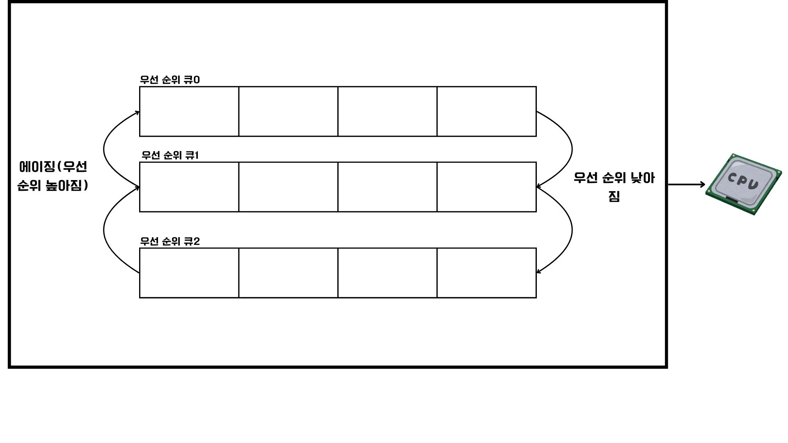

# CPU 스케줄링 알고리즘

대표적인 7가지 CPU 스케줄링 알고리즘에 대해 알아보겠다.

## 1. 선입 선처리 스케줄링(FCFS, First Come First Served)

큐에 삽입된 순서대로 CPU를 요청한 프로세스부터 할당하는 방식이다. 프로세스들이 기다리는 시간이 매우 길어질 수 있다는 단점이 있다.
먼저 삽입된 프로세스의 오랜 실행 시간으로 인해 나중에 삽입된 프로세스의 실행이 지연되는 문제를 호위 효과(convoy effect)라고 한다.

## 2. 최단 작업 우선 스케줄링(SJF, Short Job First)

준비 큐에 삽입된 프로세스 중 CPU를 이용하는 시간의 길이가 가장 짧은 프로세스 부터 먼저 실행하는 방식이다.
기본적으로 비선점형 스케줄링 알고리즘으로 분류되지만, `최소 잔여 시간 우선 스케줄링`처럼 선점형으로 구현될 수도 있다.

## 3. 라운드 로빈 스케줄링(round robin)

선입 선처리 스케줄링에 타임 슬라이스라는 개념이 더해진 방식이다.
프로세스가 CPU를 사용하도록 정해진 시간을 부여한다.
큐에 삽입된 프로세스들이 삽입된 순서대로 CPU를 이용하지만, 정해진 타입 슬라이스만큼만 CPU를 이용하는 선점형 스케줄링이다.
정해진 시간을 모두 사용하지 않고도 완료되지 않았다면 문맥 교환에 의해 다시 큐의 맨 뒤에 삽입된다.

## 4. 최소 잔여 시간 우선 스케줄링(SRT, Shortest Remaining Time)

최단 우선 작업 우선 스케줄링과 라운드 로빈 스케줄링을 합친 방식이다.
프로세스는 정해진 시간만큼 CPU를 사용하되, 남아 있는 작업 시간이 가장 적은 프로세스를 다음 할당 프로세스로 선정한다.

## 5. 우선순위 스케줄링(priority)

프로세스마다 우선순위를 부여하고, 가장 높은 우선순위를 가진 프로세스부터 실행하는 방식이다.
프로세스의 우선순위를 바탕으로 스케줄링하는 방식은 근본적인 문제가 있다. 
우선순위가 높은 프로세스를 먼저 처리하기 때문에 우선순위가 낮은 프로세스는 먼저 대기 큐에 삽입되었더라도 실행이 연기될 수 있다
이를 `기아 현상(starvation)`이라고 하며, 이를 해결하기 위해 aging이라는 방법이 생겼다.
`에이징`은 오랫동안 대기한 프로세스의 우선순위를 점차 높이는 방식이다.

## 6. 다단계 큐 스케줄링(multilevel queue)

우선순위별로 여러 개의 준비큐를 사용하는 방식이다. 우선순위가 가장 높은 큐의 프로세스를 먼저 할당한다.
가장 높은 큐가 비어있다면, 그 다음 우선순위가 높은 큐의 프로세스를 할당한다.
다단계 큐 스케줄링에서는 큐들 간의 이동이 불가능하기 때문에 우선순위가 낮은 프로세스의 작업이 계속해서 연기될 수 있다.
이를 보완하기 위해 `다단계 피드백 큐 스케줄링`이 생겼다.

## 7. 다단계 피드백 큐 스케줄링(multilevel feedback queue)

다단계 큐 스케줄링과 비슷하게 동작하지만, 프로세스들이 큐 사이를 이동할 수 있다는 차이점이 있다.
다단계 피드백 큐 스케줄링에 새롭게 진입하는 프로세느느 먼저 우선순위가 가장 높은 우선순위 큐에 삽입되고, 지정된 타임 슬라이스동안 수행된다.
만약 해당 시간동안 프로세스를 마치지 못했다면 다음 우선순위 큐에 삽입되어 실행된다.
결론적으로 오래 CPU를 사용해야 하는 프로세스의 우선순위가 점차 낮아지게 된다.
비교적 적게 사용해야하는 `입출력 프로세스`들은 우선순위가 높은 큐에서 실행이 끝나고, `CPU 집중 프로세스`들의 우선순위는 낮아지게 된다.
또한 기아 현상을 예방하기 위해 낮은 우선순위 큐에서 오래 기다리고 있는 프로세스들은 높은 우선순위 큐로 이동시키는 `에이징 기법`도 적용할 수 있다.

