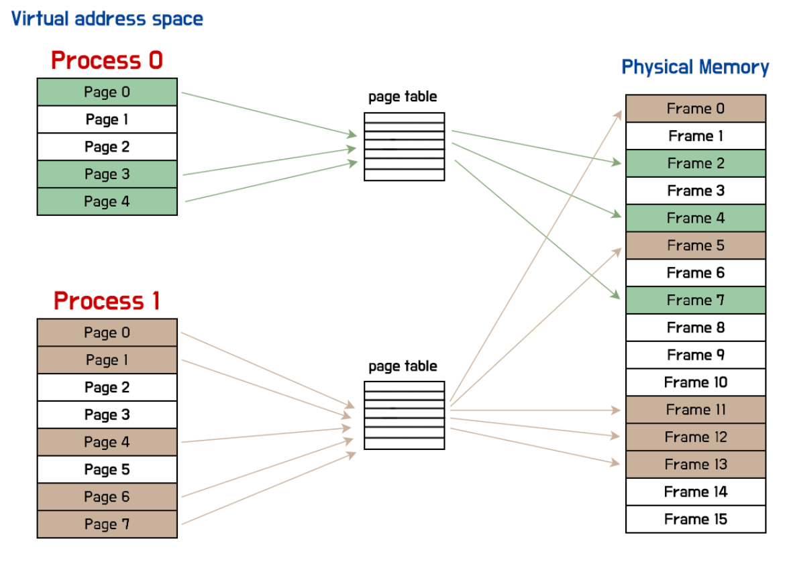

# 가상 메모리

실제 CPU 내부의 저장공간이 메모리만큼 커야 들어갈 수 있으나, 실제로는 더 작은 용량을 갖고 있다. 
새로운 프로세스는 새롭게 메모리에 적재되고, 사용되지 않는 프로세스는 메모리에서 삭제된다.
CPU가 실시간으로 바뀌는 정보를 어떻게 관리하는지 논리 주소, 가상 메모리, 페이징에 대해 알아보겠다.

## 물리 주소와 논리 주소

CPU와 프로세스는 메모리의 하드웨어의 실제 주소인 물리 주소(physical address)가 아닌 논리 주소(logicla address)를 사용한다.
논리 주소는 프로세스마다 부여되는 0번의 주소부터 시작하는 주소 시스템을 말한다.
CPU와 프로세스가 사용하는 주소 체계는 물리 주소가 아니라 논리 주소이기 때문에 중복되는 물리 주소의 번지 수는 존재하지 않지만, 중복되는 논리 주소의 번지 수는 얼마든지 생길 수 있다.
하지만 실제 정보가 저장되어 있는 하드웨어 상의 메모리와 상호작용하기 위해서는 논리 주소와 물리 주소로 변환되어야 한다. 이때 존재하는 하드웨어가 바로 메모리 관리 장치(Memory Management Unit)이다.
MMU는 CPU와 메모리 사이에서 존재하며, CPU가 이해하는 논리 주소를 메모리가 이해하는 물리 주소로 변환시킨다.

## 스와핑과 연속 메모리 할당

`스와핑`이란 메모리에 적재된 프로세스 중에는 현재 실행되고 있지 않은 프로세스도 있을 수 있다.
입출력 작업을 요구하며 대기 상태가 되었거나 오랫동안 사용하지 않은 프로세스가 있을 수도 있다.
이러한 프로세스들을 임시로 `스왑 영역`이라는 보조기억장치의 일부 영역으로 보내고, 비어이는 메모리에 다른 프로세스를 적재한다.
보조기억 장치의 일부 영역으로 보내는것을 `스왑 아웃`, 스왑영역에 있는 프로세스를 다시 메모리에 적재 시키는 것을 `스왑 인`이라고 한다.

## 연속 메모리 할당과 외부 단편화

프로세스에 연속적인 메모리 공간을 할당하는 방식을 `연속 메모리 할당` 이라고 한다.
연속 메모리 할당을 사용할 경우 비효율적인 문제가 생길 수 있으며 이를 `외부 단편화`라고 한다.
오른쪽은 남은 메모리가 총합 50MB이지만 10MB, 40MB의 각각의 공간을 갖고 있기 때문에 만약 50MB의 프로세스를 적재하고 싶다면 불가능한 상황이 발생한다.
프로세스 바깥에 생기는 빈 공간들은 사용가능하지만 큰 프로세스를 적재하기 어려워 메모리 낭비가 발생할 수 있다.

## 페이징을 통한 가상 메모리 관리

위 외부 단편화 문제를 해결하기 위해 가상 메모리를 사용한다. 실제 메모리보다 더 큰 프로세스를 사용할 수 있도록 만드는 메모리 관리 기법이다.
보조기억장치의 일부를 메모리처럼 사용하거나 프로세스의 일부만 메모리에 적재함으로써 실제 크기보다 더 크게 보이게 하는 기술이다.
가상 메모리 기법으로 생성된 논리 주소 공간은 가상 주소 공간이라고도 부른다.
대표적인 가상 메모리 관리 기법에는 `페이징`과 `세그멘테이션`이 있다. 둘 중 페이징이 더 범용적으로 사용된다.

### 페이징

프로세스의 논리 주소 공간을 페이지라는 일정한 단위로 나누고, 물리 주소 공간을 페이지와 동일한 크기의 프레임으로 나눈다.
그 후 페이지를 프레임에 할당하게 된다.
프로세스를 구성하는 페이지는 물리 메모리에 불연속적으로 배치될 수 있다. 
일정한 크기로 잘린 프로세슫르을 메모리에 불연속적으로 할당하기 때문에 외부 단편화를 방지할 수 있다.
페이징에서도 스와핑이 사용될 수 있다.  페이징을 사용할 경우 프로세스 전체가 스왑 아웃,스왑 인 되는 것이 아닌 페이지 단위로 스왑 아웃, 스왑 인이 수행된다. 이를 페이지 인, 페이지 아웃이라 부른다.
이를 다시 말하면 페이지 일부는 메모리에 적재되고, 일부는 보조기억장치에 적재되었다고 할 수 있다. 이를 다시 말하면 꼭 메모리에 모든 프로세스가 적재 될 필요는 없다는 말이 된다.
하지만 아직 문제점이 있는데 불연속적인 페이지의 배치때문에 다음 실행판 페이지의 위치를 찾기가 어렵다는 점이다.
이를 보완하기 위해 `페이지 테이블`이 생겨났다.

### 페이지 테이블
페이지 번호와 실제로 적재된 프레임의 번호가 대조되어 있다. CPU는 그 테이블을 보고 빠르게 찾아나갈 수 있다.
프로세스마다 각자의 페이지 테이블 정보를 갖고 있어 각각의 페이지 테이블을 참조하여 메모리에 접근한다.
페이지 테이블의 각각의 행들을 테이블 엔트리라고 하며 페이지 번호, 프레임 번호, 유효 비트, 참조 비트, 수정 비트들이 담겨있다.
`유효 비트`는 해당 페이지에 접근이 가능한지 여부를 알려 주는 중요한 정보로 현재 페이지가 메모리에 담겨있는지 보조기억장치에 담겨 있는지 알려주는 비트이다.
1이라면 메로이제 적재, 0이라면 보조기억장치에 적재되어있다는 뜻이다. 하지만 CPU는 보조기억장치에 저장된 페이지에 바로 접근이 불가능하기 떄문에 보조기억장치속 메모리를 메모리에 적재한 뒤 접근을 해야 한다.
CPU가 메모리에 적재되지 않은 페이지(유효 비트 0)인 페이지에 접근하려 하면 `페이지 폴트(page fault)` 라는 예외가 발생한다.
`보호 비트`는 rwx의 조합으로 읽기, 쓰기, 실행이 모두 가능하다.
`참조 비트`는 해당 페이지에 CPU가 접근한 적이 있는지 여부를 판단하는 비트이다.
`수정 비트, 더티 비트`는 해당 페이지에 데이터를 쓴 적이 있는지를 판단하는 비트이다.

### 내부 단편화
이러한 페이징은 외부 단편화는 해결할 수 있지만 내부 단편화라는 문제가 있다. 모든 프로세스가 페이지 크기에 맞춰 잘라지는 것이 아니기때문에 만약 9KB 프로세스이고 페이지 크기가 10KB라면 1KB의 메모리가 낭비되는 것이다.

## 페이지 테이블 베이스 레지스터(Page Table base Register)
프로세스마다 가지는 정보로 PCB에 저장되며, 다른 프로세스의 문맥 교환이 발생할 떄 변견된다. 이러한 테이블은 메모리에 적재된다.

## TLB(Translation Lock-aside Buffer) 
프로세스에 페이지 테이블이 메모리에 적재되어 있는 경우, CPU는 페이지 테이블에 한 번 접근하고, 실제 프레임에 한 번 접근해서 두 번을 거쳐야 하기 때문에 시간이 두배로 늘어난다.
이를 해결하기 위해 TLB라는 페이지 테이블을 캐싱한 메모리가 사용된다.
이미 TLB에 있는 페이지 번호는 TLB히트라고 하며 한 번만 메모리에 접근하면 된다.

### 세그멘테이션

프로세스를 일정한 크기의 페이지가 아닌 가변적인 크기의 `세그멘트`단위로 분할한다. 페이징 기법처럼 프로세스를 나누는 단위가 일정하지 않아도 가능한 방식이다.
한 세그멘트는 코드 영역이거나 데이터 영역일 수도 있다. 하지만 세그멘트의 크기들은 일정하지 않기 때문에 외부 단편화가 발생할 수 있다.

## 페이지 교체 알고리즘
메모리를 프로세스에 적재할때 모든 페이지를 메모리에 적재하지 않아도 되기 때문에 꼭 필요한 페이지만 메모리에 적재하는 기법을 요구 페이징(demand paging)이라고 한다.
해당 페이지가 현재 메모리에 있는 경우 유효 비트가 1의 값을 갖고 있으므로 페이지가 적재된 프레임으로 접근을 한다. 만약 페이지 폴트(유효 비트 0)가 발생하면 페이지 폴트 처리 루틴을 통해 페이지를 메모리에 적재하고, 유효 비트가 1로 바뀐다.
아무런 페이지도 메모리에 적재되지 않는 초기의 경우에 프로세스를 실행할 경우 첫 명령부터 페이지 폴트가 발생하기 때문에 `순수 요구 페이징`이라고 한다.
메모리가 가득 찬 경우에는 추가적인 페이지 적재를 위해 일부 페이지를 스왑 아웃 해야 하는 상황이 발생한다. 이때 페이지 교체 알고리즘을 사용한다.
적절한 페이지 교체 알고리즘은 사용되지 않는 페이지를 보조기억장치로 보내기 때문에 페이지 폴트 발생 빈도가 적지만, 적절하지 않은 알고리즘은 페이지 폴트 발생량이 증가한다.
또한, 지나친 페이지 교체로 인한 성능 저하의 경우 thrasing(스래싱)이 발생하며 실제 프로세스의 실행시간보다 더 많은 시간을 소요하기 때문에 성능적으로 저하된 상황이다.

### FIFO 페이지 교체 알고리즘

큐와 동일한 방식이며 가장 먼저 적재된 페이지부터 스왑 아웃하는 알고리즘이다. 초기부터 줄곧 참조되고 있어서 스왑 아웃할 수 있는 상황이 생기기 때문에 좋지 못한 알고리즘일 수도 있다.

### 최적 페이지 교체 알고리즘

앞으로도 사용 빈도가 가장 낮은 페이지를 교체하는 알고리즘이다. 메모리에 ㅈ거재된 페이지들중 앞으로 가장 적게 사용할 페이지를 스왑 아웃하여 낮은 페잊 폴트율을 보장할 수 있다.
미리 예측을 해야 하기 때문에 실제 구현이 어렵다.

### LRU 페이지 교체 알고리즘
가장 적게 사용한 페이지를 교체하는 알고리즘으로 보편적으로 사용되는 교체 알고리즘이다.

