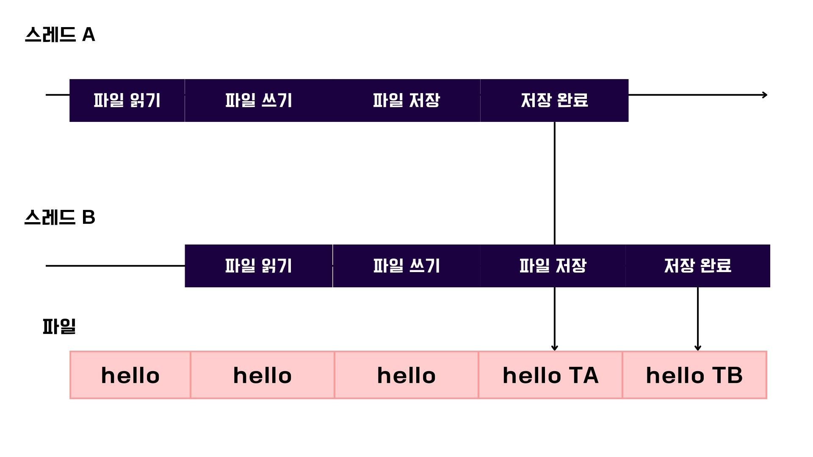
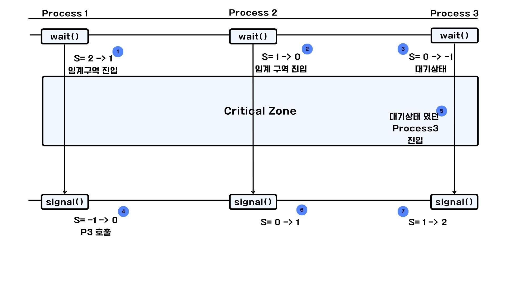
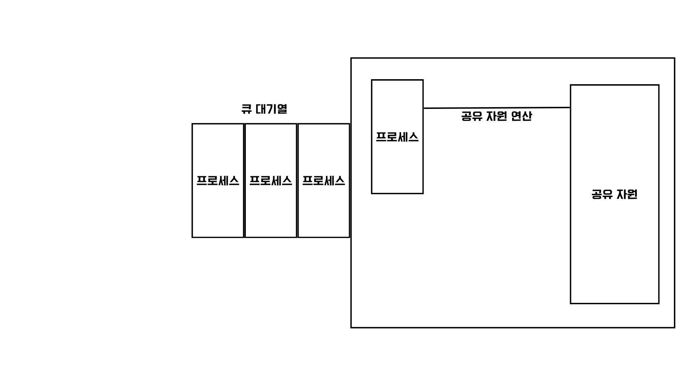
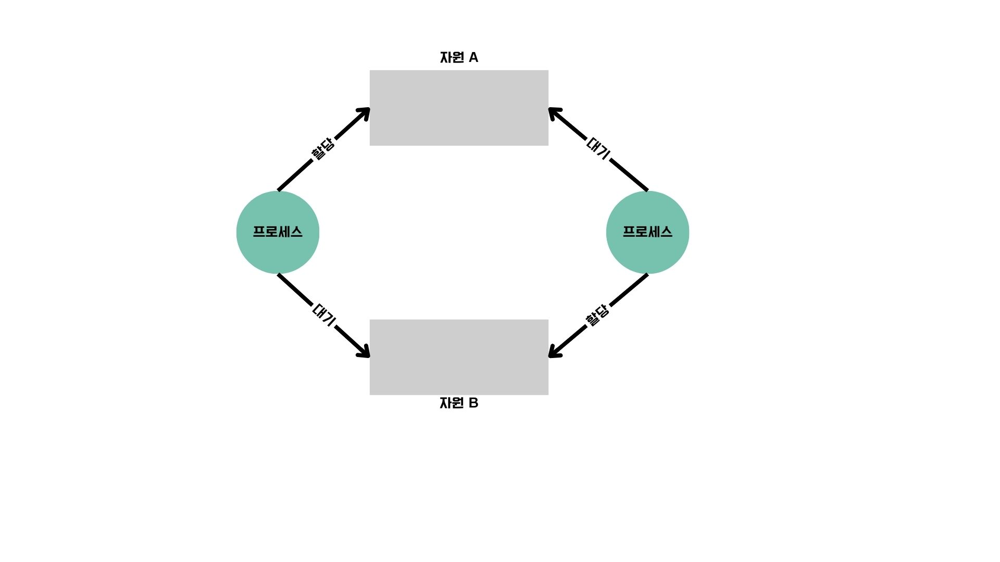
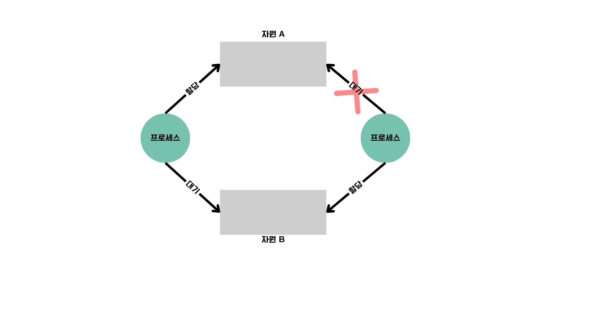

# 동기화와 교착 상태

## 공유 자원
메모리나 파일 등의 자원 또는 전역 변수, 입출력장치를 두고 동시에 여러 개의 프로세스 또는 여러 개의 스레드가 실행된다면 일관성의 문제, 레이스 컨디션 문제가 발생할 수 있다.
공유자원에 접근하는 코드 중 동시에 실행됐을 때 문제가 발생할 수 있는 영역을 `임계 구역(critical section)`이라고 한다. 



## 레이스 컨디션
위처럼 동시 다발적으로 실행되는 동안에는 언제나 `임계 구역`을 동시에 실행하지 않도록 유의해야 한다. 그렇지 않으면 데이터의 일관성이 손상이 되며 이를 `레이스 컨디션`상황 이라고 한다.
이러한 레이스 컨디션을 제어하기 위해서 `동기화`의 개념이 필요하다.

## 동기화(synchronized)

실행 순서의 제어를 통해 프로세스 및 스레드를 올바른 순서로 실행해야 하며, 동시에 접근해서는 안되는 자원에 하나의 프로세스 및 스레드만 접근할 수 있도록 설정해야 한다.

## 동기화 기법 - 뮤텍스 락(mutex lock)

동시에 접근 해서는 안되는 자원을 락(lock)을 걸어서 상호 배제의 개념을 적용한 것이다.
전형적인 뮤텍스 락은 프로세스 및 스레드가 공유하는 변수(lock)와 acquire,release로 구성되어 있다.
뜻 그대로 acquire를 통해 lock을 얻을 수 있으며 특정 락에 대해 한 번만 호출이 가능하다. release는 lock을 해제하기 위한 함수이다.
`임계 구역`에 진입하기 위해서는 lock.acquire()을 통해 진입을 하고, 이때 다른 프로세스들은 lock.release()로 해제하기 전까지는 진입이 불가능하다.
java에서는 lock.lock()으로 lock을 획득할 수 있다. unlock()으로 lock을 해제할 수 있다.
```java
static class Increment implements Runnable{
    public void run(){
        for (int i = 0; i < 10000; i++) {
            lock.lock();
            try{
                sharedData++;
            }finally{
                lock.unlock();
            }
        }
    }
}
```

## 동기화 기법 - 세마포

한 번에 하나의 프로세스 및 스레드만 공유 자원을 이요할 수 있는 상황도 있지만, 한 번에 하나 그 이상의 프로세스 및 스레드까지 특정 자원에 대해 사용할 수 있는 상황이 생긴다.
`세마포`는 뮤텍스 락과 유사하지만, 조금 더 일반화된 동기화 방식이다.
`세마포`를 이용하면 공유 자원이 여러 개 있는 상황에서도 동기화가 가능하다.
세마포는 하나의 변수 S 와 두개의 함수(wait(),signal())로 구성되어 있다.


### wait()

- wait() 함수 호출 시, 사용 가능한 공유 자원의 개수를 나타내는 변수를 1감소 시키고 변수 값이 0보다 작은지 여부를 판단한다.
- 변수를 감소시켰을 때 변수가 0 이상이라는 것은 사용 가능한 공유 자원의 개수가 아직 남아있다는 것이다.
- 이 경우, wait()을 호출한 프로세스 및 스레드는 임계 구역에 진입한다.
- 반대로 0 미만인 경우에는 진입이 불가능하다.


### signal()

- 사용 가능한 공유 자원의 개수를 1 증가 시키고, 변수의 값이 0이하인지를 확인한다. 
- 1증가시켰을 때 0보다 크다는 것은 공유 자원의 개수가 1개 이상 남아있다는 것이며, 0 이하라는 것은 임계 구역에 진입하기 위한 프로세스가 존재함을 의미한다.
- 0인 경우에는 대기 상태로 접어든 프로세스 중 하나를 준비 상태로 전환한다.




## 동기화 기법 - 모니터

모니터는 `조건 변수`를 이해하고 싲가해야 한다. `조건 변수`란 실행 순서 제어를 위한 동기화 도구로, 특정 조건 하에 프로세스를 실행/일시 중단하여 프로세스나 스레드의 실행 순서를 제어한다.
조건 변수에 대해 wait(), signal()함수를 호출할 수 있다. wait()은 프로세스 및 스레드의 상태를 대기 상태로 전환하며, signal() 함수는 중지된 프로세스 및 스레드의 실행을 재개한다.


`모니터`는 공유 자원과 공유 자원을 다루는 함수로 구성된 도익화 도구이다.
상호 배제를 위한 동기화, 실행 순서 제어를 위한 동기화까지도 가능하다.
프로세스 및 스레드는 공유 자원에 접근하기 위해 정해진 공유 자원 연산을 통해 모니터 내로 진입해야 하고, 모닡터 안에 진입하여 실행되는 것은 항상 하나여야 한다.
이미 모니터에 진입한 프로세스 또는 스레드가 존재하는 경우 큐에서 대기하게 된다.



### 예시

프로세스 A와 B가 있고 다음과 같은 조건이 있다. 프로세스 A는 B보다 먼저 실행되어야 한다.

- 프로세스 A가 B보다 먼저 진입한 경우
  - 프로세스 A가 먼저 실행되어 모니터내로 진입되었고 공유자원을 사용중이며 그 이후 B가 진입한 경우 정상적으로 모니터 내로 진입하여 실행된다.
  - 이때 A가 종료된 후 B가 수행되므로 B는 큐에 들어가게 된다.
- 프로세스 B가 A보다 먼저 진입한 경우
  - 이때는 특정 조건 변수에 대해 wait() 메서드가 호출되어 B를 대기 상태에 접어들게한다.
  - B가 대기하고 있는 사이에 A에 모니터 내로 진입하여 실행되고, signal() 메서드를 호출하여 대기 상태에 있던 B를 호출하여 모니터 안으로 재진입시킨다.


# 스레드 안전

스레드 안전이란 멀티 스레드 환경에서 어떤 변수나 함수, 객체의 동시 접근이 이루어져도 실행에 문제가 없는 상태를 의미한다. 
레이스 컨디션 같은 상황이 발생했다면 이는 스레드 안전이 이뤄지지 않은 상황인 것이다.
Java에서는 Vector가 동기화가 되어 있으며 코드 내부를 보면 synchronized키워드가 있는 것을 볼 수 있다.
ArrayList는 동기화가 되어 있지 않다.

# 교착 상태

프로세스를 실행하기 위해서는 자원이 필요하며, 2개 이상의 프로세스가 각자 갖고 있는 자원을 무제한으로 대기한다면 서로 접근할 수 없는 교착 상태가 발생한다.
`교착 상태`란 일어나지 않을 사건을 기다리며 프로세스의 진행이 멈춰 버리는 현상을 말한다.

## 교착 상태 발생 조건

1. 상호 배제
   - 한 번에 하나의 프로세스만 해당 자원 이용이 가능하다.
2. 점유와 대기
    - 한 프로세스가 어떤 자원을 할당받은 상태에서 다른 자원 할당받기를 기다리면 교착 상태가 발생할 수 있다.
3. 비선점
   - 비선점 또한 교착 상태 발생의 근본적 문제라고 할 수 있다. 비선점은 해당 프로세스의 작업이 끝나야만 다른 프로세스가 작업이 가능함을 뜻한다.
4. 원형 대기
   - 프로세스와 프로세스가 요청한 자원이 원의 형태를 이루는 경우이다. 각각의 프로세스가 서로 점유한 자원을 할당받기 위해 원의 형태로 대기하는 경우 교착상태가 발생한다.




## 교착 상태 해결 방법

1. 교착 상태 예방
    - 교착 상태를 발생시키는 4가지 필요 조건 중 하나를 충족하지 못하게 하는 방법이다.
    - 하나의 프로세스에 필요한 자원을 몰아주고 점유와 대기 조건을 만족시키지 않게 하게 한다.
    - 모든 자원에 번호를 매기고 오름차순으로 할당하는 경우 원형 대기 조건을 만족하지 않으므로 교착상태가 발생하지 않는다.



2. 교착 상태 회피
   - 교착 상태가 발생하지 않을 정도로만 자원을 할당한다.
   - 자원이 충분한 상황에서 프로세스들이 무분별한 할당을 받지 않도록 한다.
   - 은행원 알고리즘이 이에 해당한다.

>은행원 알고리즘
> 
> 시스템 교착을 일으키지 않고 각 프로세스가 요구한 양 만큼의 자원을 할당해줄 수 있는 순서를 안전순서열이라고 하며, 안전순서열이 존재하는 상태를 안전상태, 존재하지 않는 상태를 불안전상태라고 한다.
> 이를 이용한 것이 은행원 알고리즘이다.

3. 교착 상태 검출 후 회복
   - 이미 일어난 교착 상태가 있다면 자원 선점을 통해 회복시키거나, 교착 상태에 놓인 프로세스를 강제 종료 시켜서 회복시킬 수 있다.
