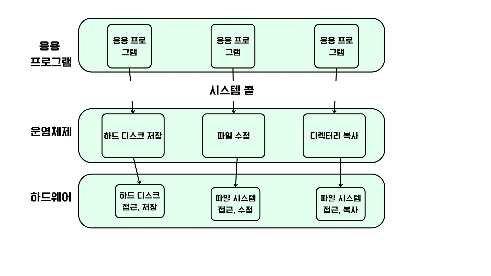
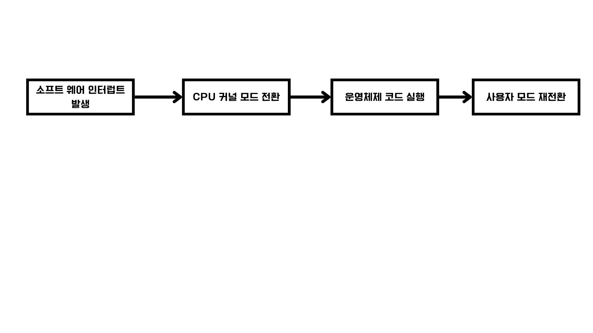
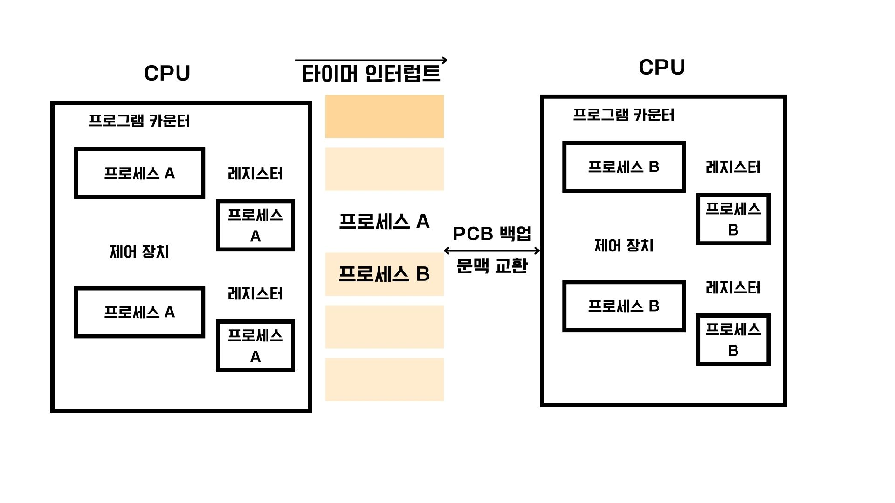

# 목차

# 시스템 콜과 이중 모드

## 시스템도 일종의 프로그램이다.

- 운영체제도 하나의 프로그램이기 때문에 프로그램이 실행되기 위해서는 반드시 메모리에 적재되어야 한다.
- 운영체제는 매우 특별한 프로그램이므로 메모리 내의 `커널 영역`이라는 공간에 따로 적재되어 실행된다.
- 반대로 사용자 응용 프로그램은 `사용자 영역`이라는 공간에 적재된다.
- 운영체제의 기능을 사용하기 위해서는 `커널 영역`에 적제된 운영체제 코드를 실행해야 한다.

## 시스템 콜

- 운영체제의 서비스를 제공받기 위한 수단(인터페이스)
- 호출 가능한 함수의 형태
- 웹 브라우저, 게임과 같은 응용 프로그램들은 CPU, 메모리에 직접 접근할 수 없다.
  - 특정 자원에 접근하거나 조작하는 운영체제 코드를 실행해야 한다.
  - 운영체제가 자신의 코드를 실행한 응용 프로그램의 자원 접근 및 조작을 대신한다.
  - 말로는 어려우니 이미지를 통해 이해하는 것이 좋다.
- 시스템 콜의 종류와 개수는 다양하다.
  - fork : 새 자식 프로세스 생성
  - execve() : 프로세스 실행(메모리 공간을 새로운 프로그램으로 덮어씌움)
  - exit() : 프로세스 종료
  - waitpid() : 자식 프로세스가 종료할 때까지 대기

### 프로세스의 계층 구조
fork() 시스템 콜을 통해 계속해서 새로운 프로세스를 생성한다. 이때 새 프로세스를 생성한 프로세스를 `부모 프로세스`, 부모 프로세스에 의해 생성된 프로세스를 `자식 프로세스`라고 한다.

`시스템 콜`이 호출되면 다음과 같은 작업이 수행된다.

## 소프트웨어 인터럽트
`소프트웨어 인터럽트`란 자원에 접근하는 입출력 명령어가 대표적이며, 이러한 명령어에 의해 발생하는 인터럽트를 말한다.
`시스템 콜`이 바로 이 소프트웨어 인터럽트의 일종이다.위 그림을 다시 한 번 순서로 풀어내면 다음과 같다.

> 1. 사용자 영역을 실행하는 과정에서 시스템 콜이 호출
> 2. CPU는 현재 수행 중인 작업을 백업
> 3. 커널 영역 내의 인터럽트를 처리하기 위한 코드를 실행
> 4. 다시 사용자 영역의 코드 실행을 재개

이때 위에서 말한 사용자 영역에서 커널 영역에 적재된 코드를 실행하는데 이 실행 모드를 `커널 모드`라고 한다.
`커널 모드`에서는 자원에 접근하는 (파일 입출력 등)명령어를 비롯한 모든 명령어를 실행할 수 있다.
반대로 사용자 영역으로 돌아가서 다시 수행될 때는 `사용자 모드`라고 한다.
`사용자 모드`에서는 이러한 자원에 대한 접근이 불가하다.
이 두가지 모드를 구분하여 실행하는 것을 **이중모드**라고 한다.

### 예시

응용 프로그램은 실행 과정에서 시스템 콜을 매우 빈번하게 호출한다.
만약 화면에 "hello world"라는 문자열을 출력하는 단순한 프로그램조차 실행 과정에서 600회 이상의 시스템 콜을 호출한다고 한다.
리눅스나 우분투에서 `ls -al` 등의 명령어 또한 프로그램이기 때문에 마찬가지로 많은 시스템 콜을 호출한다.

## 프로세스 생명 주기

운영체제마다 상태를 표현하는 방식은 조금씩 차이가 있지만, **대부분 생성,준비,실행,대기,종료**가 있다.

### 생성 상태(new)
프로세스를 생성 준비 중인 상태, 메모리에 적재되어 PCB를 할당받은 상태
생성 상태를 거쳐 실행 할 준비가 된 프로세스는 CPU의 할당을 대기한다.

### 준비 상태
자신의 차례가 올 때 까지 준비 상태이며, CPU를 할당받으면 실행 상태가 된다.
준비 사앹에서 실행 상태로 전환될 떄 `디스패치(dispatch)` 라고 한다.

### 실행 상태
CPU를 할당받아 실행 중인 상태, 일정 시간동안 CPU를 사용할 수 있다.
할당된 시간을 모두 사용하면 타이머 인터럽트가 발생하며 다시 준비상태가 된다.

### 대기 상태
프로세스가 입출력 작업을 요청하거나 바로 확보하지 못하는 자원을 요청하는 등 실행이 당장 불가능한 조건에 놓이는 경우 대기상태에 진입한다.
대기 상태였던 프로세스는 입출력이 완료되는 등 실행 가능한 상태가 되면 다시 준비 상태가 되어 CPU할당을 기다린다.

### 종료 상태
프로세스가 종료된 상태
운영체제는 PCB와 프로세스가 사용한 메모리를 정리한다.

> 블로킹 입출력
> 
> 프로세스가 실행 도중 입출력을 수행해야 하는 상황인 경우 프로세스는 대기 상태에 접어들고, 입출력 작업이 완료되면 준비 상태가 실행 되어 작업을 재개한다.
> 이러한 유형 입/출력 방식을 블로킹 입출력이라고 한다.
> 예를 들어 네트워크에 메세지를 보내는 시스템 콜을 호출후 송신 작업 완료를 확인할 때 까지 대기 상태로 접어드는 경우 이다.

> 논블로킹 입출력
> 
> 입출력 장치에게 입출력을 맡긴 뒤 곧바로 이어질 명령을 실행한다.
> 논 블로킹의 경우 네트워크에 메세지를 보낸 후 곧바로 다음 명령을 수행 할 수 있다.

