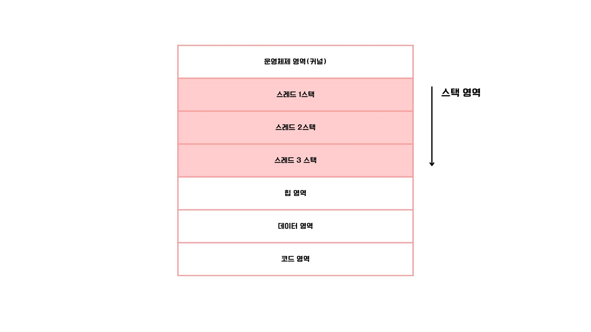
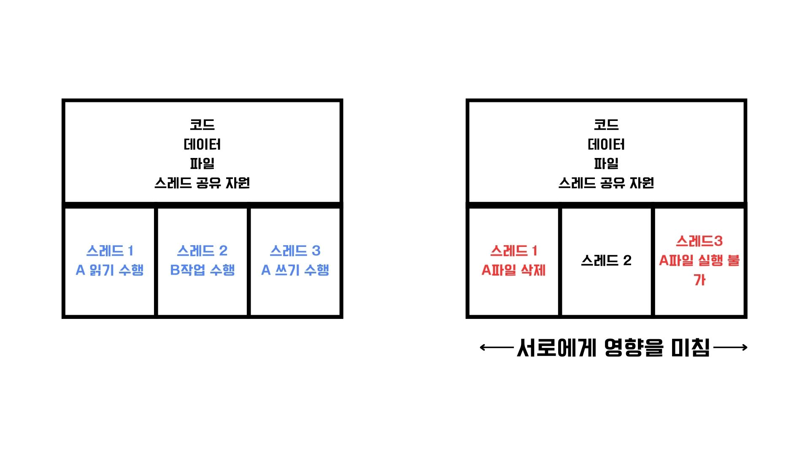

# 멀티 프로세스와 스레드

## 웹 브라우저
웹 브라우저는 일반적으로 하나틔 탭마다 하나의 프로세스로 동작한다.
유저들이 자주 쓰는 크롬 부라우저에서 열고 있는 하나의 탭들이 하나하나의 프로세스이며 동시에 여러 프로세스가 수행되고 있다면 `멀티 프로세스`라고 부른다.

## 멀티 프로세서
기본적으로 자원을 공유하지 않고, 독립적으로 수행된다. 같은 작업을 수행하고 있지만 `PID`값이 다르고, 프로세스 별로 파일과 입출력 장치 등의 자원이 독립적으로 할당되어 다른 프로세스에 영향을 끼치지 않는다.

## 멀티 스레드
하나의 프로세스 안에서 동시에 같은 코드를 여러 번 실행시킬 수 있는 방법이다. 하나의 스레드는 스레드를 식별할 수 있는 ID값, 프로그램 카운터, 레지스터 값, 스택 등으로 구성되어있다.
스레드마다 각각의 프로그램 카운터 값과 스택을 갖고 있기 때문에 실행할 주소를 가질 수 있고, 연산 과정의 임시 저장 값을 가질 수 있다.

## 멀티 스레드 vs 멀티 프로세스

이 둘의 가장 큰 차이점은 **자원 공유** 여부이다. 
`프로세스`들은 자원을 공유하지 않기 때문에 독립적으로 실행되지만, 하나의 프로세스에서 동작하는 `멀티 스레드`들은 프로세스의 자원을 공유한다.
스레드들은 동일한 주소 공간의 코드, 데이터, 힙 영역을 공유하며, 프로세스의 자원을 공유하기 때문에 쉽게 데이터를 통신하고 협력할 수 있다.
`멀티 프로세스` 환경에서는 한 프로세스에 문제가 생겨도 다른 프로세스에는 문제가 발생하지 않지만, `멀티 스레드`에서는 하나의 문제가 전체 문제가 될 수도 있다.

## 프로세스간의 통신

프로세스 간에는 자원을 공유를 기본적으로 하지 않지만, 자원을 공유하고 데이터를 주고 받을 수 있는 방법도 존재한다.
`프로세스 간 통신(IPC,Inter-Process Communication` 이라는 방법이다. 프로세스 간 통신 방식에는 `공유 메모리와 메세지 전달`이 있다.

### 공유 메모리 

- 말 그대로 프로세스가 공통적으로 사용할 메모리 영역을 두어 데이터를 주고 받는 공간이다. 
- 이 메모리 영역을 두고 각 프로세스가 자신의 메모리 영역인 것처럼 읽고 쓰는 것처럼 통신한다. 
- 이 때는 커널의 개입이 거의 없다. 메세지 전달 방식 보다 통신 속도가 빠르다. 
- 하지만 서로의 공유 메모리 영역을 동시에 읽고 쓸 경우에는 데이터의 일관성이 훼손될 수 있으며 이를 **레이스 컨디션**이라고 한다.

### 메세지 전달

- 프로세스 간 주고받을 데이터를 메세지 형태로 주고 받는 방식이다.
- 데이터가 커널을 거쳐 송수신 통신을 하는 방식이다.
- 메세지를 보내는 시스템 콜인 send()라는 시스템 콜과 메세지를 받은 시스템 콜인 recv()이 정해져 있고, 각 프로세스는 이 시스템 콜들을 호출하여 메세지를 송/수신한다.
- 공유 메모리 기반 IPC보다 커널의 도움을 받아 `레이스 컨디션`, `동기화`등의 문제를 고려하는 일이 상대적으로 적다.
- 하지만, 주고 받는 데이터가 커널을 통해 송/수신 되므로 공유 메모리 기반 IPC보다 통신 속도는 느리다.
- 대표적인 수단으로는 `파이프, 시그널, 소켓, 원격 프로시저 호출(RPC)`가 있다.

>파이프란?
> 
>  단방향 프로세스 간의 통신 도구이다.
> 한 쪽은 읽기를 수행하면 다른 한쪽은 쓰기를 수행한다.
> 양방향 통신을 수행할 경우, 읽기용 파이프와 쓰기용 파이프 2개를 이용해 양방향으로 통신할 수 있다.
> 
> 익명 파이프(unnamed pipe)
> 
> 양방향 통신을 지원하지 않고, 부모 프로세스와 자식 프로세스간의 통신만 가능하다.
> 
> 지명 파이프(named pipe or FIFO)
> 
> 지명 파이프는 양방향 통신을 지원하며, 부모와 자식간의 프로세스 뿐만 아니라 임의의 프로세스와도 통신이 가능하다.

> 시그널이란?
> 
> 프로세스에게 특정 이벤트가 발생했음을 알리는 비동기적 신호
> 대부분 인터럽트와 관련된 이벤트지만, 사용자가 직접 정의할 수 있는 시그널도 있다.
> 프로세스는 시그널이 발생하면 다른 인터럽트와 동일하게 하던 일을 잠시 중단하고, 시그널 처리를 위한 시그널 핸들러를 실행한 뒤 실행을 재개한다.
> 대부분은 프로세스를 종료하거나 무시하거나 코어 덤프를 생성한다. 코어 덤프는 비정상적으로 종료하는 경우 생성되는 파일로, 특정 시점에 작업하던 메모리 상태가 기록되어 있다. 