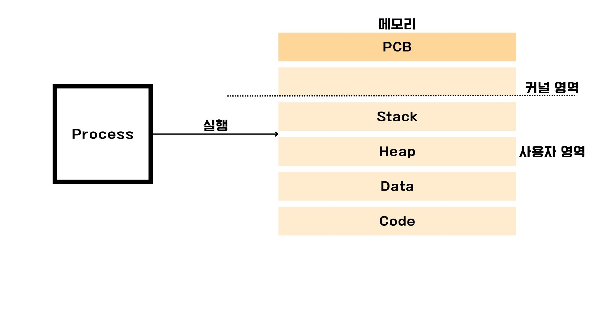
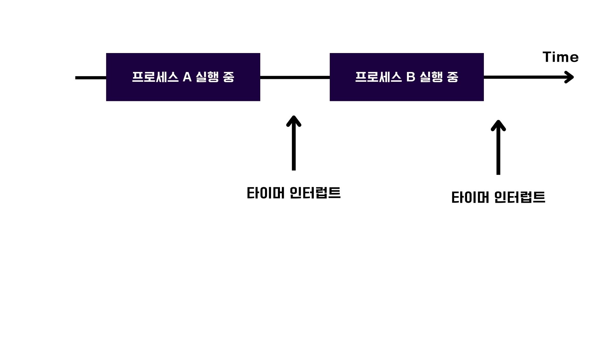

# 프로세스와 스레드

프로세스에는 사용자가 보는 공간에서 사용자와 상호작용하며 실행되는 `포그라운드 프로세스` 가 있고, 사용자가 눈에는 보이지 않지만 뒤에서 조용히 수행되는 `백그라운드 프로세스`가 있다.
`백그라운드 프로세스`중에는 `데몬`이라는 프로세스가 존재하는데 우리가 흔히 아는 `서비스`를 말한다.
이 두가지 프로세스 유형은 동일한 구조를 갖고 있다.

이 부분은 자바와 JVM을 공부하면서 들어봤을만한 내용일 것이다.

 

### 코드 영역
실행 가능한 명령어가 저장되는 공간
`텍스트 영역`이라고도 부른다.
CPU가 읽고 실행할 명령어가 담겨 있기 때문에 쓰기가 금지되어 있는 읽기 전용 공간

### 데이터 영역
프로그램이 실행되는 동안 유지할 데이터가 저장되는 공간
데이터 영역에 저장되는 데이터는 `정적 변수` 또는 `전역 변수`가 대표적이다.

> BSS 영역
> 
> BSS 영역은 데이터 영역과 유사하지만 초기화 여부가 다르다. 초깃값이 있는 정적 변수나 전역 변수의 경우에는 데이터 영역에 저장되지만, 초깃값이 없는 데이터는 BSS에 저장된다.

### 힙 영역
프로그램을 만드는 사용자(개발자)가 직접 할당 가능한 저장 공간이다.
프로그램 실행 도중 비교적 자유롭게 할당 및 사용 가능한 메모리 공간이다.
하지만 자유롭게 할당이 가능하기에 사용하지 않는 메모리를 반환하지 않으면 `메모리 누수`문제가 발생한다.
그래서 JVM과 같은 프로그래밍 언어에서는 사용되지 않는 힙 메모리를 해제하는 가비지 컬렉션 기능이 제공되고 한다.

### 스택 영역
데이터 영역에 담기는 값과 달리 일시적으로 사용할 값들이 저장되는 공간이다.
함수의 실행이 끝나면 사라지는 일회성이며 **매개변수, 지역변수, 함수 복귀 주소** 등이 스택영역에 저장된다.
스택 영역에서는 `스택 트레이스`란 개념이 있다.

> 스택 트레이스란?
> 
> 특정 시점에 스택 영역에 저장된 함수 호출 정보이다. 스택 트레이스로는 문제의 발생 지점을 추적할 수 있어 디버깅에 매우 유용하게 사용된다.

---

## PCB와 문맥 교환
메모리에 적재된 다수의 프로세스를 관리하려면 각각의 프로세스를 식별할 수 있는 커널 영역 내의 정보가 필요하다.
이 정보가 `Process Control Bloc`이다.
`PCB`는 프로세스와 관련된 다양한 정보를 내포하고 있는 `구조체(struct)`다. 그리고 새로운 프로세스가 메모리에 적재되었을 때 커널 영역에 만들어지고, 프로세스의 실행이 끝나면 폐기된다.
`PCB`에 담기는 정보는 운영체제마다 차이가 있지만 식별 번호인 `PID(Process ID)`와 실행 과정에서 사용한 `레지스터 값`,`프로세스 상태`, `CPU 스케줄링(우선순위)정보`, `메모리 관련 정보`, `파일 및 입출력장치 관련 정보`가 기재되어 있다.

>구조체란?
> 
> 다른 자료형으로 이루어진 데이터를 하나로 묶어 활용할 수 있는 복합 자료형의 일종

### PCB 테이블
여러 PCB들은 실행중인 동안에 PCB 테이블에 저장된다. 새롭게 실행되는 프로세스가 있다면 PCB프로세스 테이블에 해당 PCB를 추가하고, 종료되는 프로세스가 있다면 사용 중이던 자원을 해제하고 PCB도 프로세스 테이블에서 해제한다.

---

## 타이머 인터럽트(타임아웃 인터럽트)
프로세스는 자신의 차례가 되면 정해진 시간만큼 CPU를 이용하고, 타이머 인터럽트가 발생하면 자신의 차례를 양보하고 다음 차례가 올 떄까지 기다린다.

### 예시

프로세스A는 타이머 인터럽트가 발생하면 프로세스 B에 CPU 사용을 양보한다고 가정했을 때, 프로세스 A는 프로그램 카운터를 비롯한 각종 레지스터 값과 메모리 정보, 실행을 위해 열어뒀더 ㄴ파일 ㅈ어보, 사용한 입출력장치 등에 대한 중간 정보를 유실하지 않기 위해 저장해 둘 공간이 필요하다.
이러한 프로세스의 재개를 위해 기억해야 할 정보를 `문맥`이라고 한다.
이 `문맥`은 해당 프로세스의 `PCB`에 기록된다.
운영체제는 해당 프로세스이 PCB에 문맥을 백업하고 그 다음 실행할 프로세스의 PCB에서 정보를 가져온다.
이렇게 타이머 인터럽트에 의해 교체되는 작업에서 문맥을 통해 정보를 가져오고 새로운 프로세스를 실행하는 것을 `문맥 교환`이라고 한다.

## 문맥 교환
문맥 교환은 프로세스가 자주 번갈아가며 많은 프로세스를 동시에 실행하므로 빈번하게 일어날 수도 있다.
하지만 너무 잦은 문맥 교환이 발생하면 캐시 미스가 발생할 가능성이 높아져 메모리에서 실행할 프로세스의 내용을 가져오는 작업이 증가하고, 이는 성능이 저하되는 결과를 초래할 수 있다.

