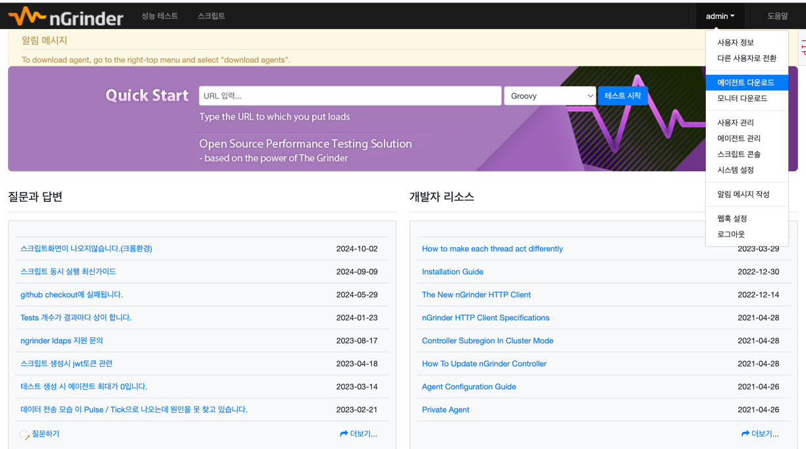

# NGrinder 문서 정리

---

- [목차](#목차)
- [nGrinder 가이드 (설치방법 및 사용법)](#nGrinder-가이드)
- [1 nGrinder란?](#1-nGrinder-란)
  - [1-1 nGrinder가 무엇인가?](#1-1-ngrinder란-무엇인가)
  - [1-2 nGrinder의 특징](#1-2-nGrinder-특징)
  - [1-3 nGrinder 아키텍처](#1-3-ngrinder-아키텍처에-대하여)
  - [1-4 nGrinder는 부하를 어떻게 주는걸까?](#1-3-nGrinder-부하테스트-원리)
- [2 nGrinder 설치](#2-nGrinder-설치방법)
  - [2-1 환경설정](#2-1-환경설정)
  - [2-2 직접 설치](#2-2-직접-설치)

<br>

# nGrinder 가이드 

[nGrinder](https://github.com/naver/ngrinder)는 네이버가 Grinder를 바탕으로 개발한 오픈소스 소프트웨어이다.
서버 부하 테스트를 할 수 있는 플랫폼으로 가상의 사용자를 생성하여 서버에 부하를 가한다.
JVM에서 동작하는 python인 jython 혹은 Groovy로 작성된 스크립트를 통해 여러 대의 장비에 테스트를 동작시키는 원리이다.
각 스레드마다 서버에 [HttpClient](https://d2.naver.com/helloworld/0881672) 객체를 사용한다.
이전에는 스레드 수가 많아질수록 부하 테스트 양의 증가가 미미해진다는 한계가 있었고, I/O를 처리하는 스레드가 많아짐에 따라 컨텍스트 스위칭 비용이 증가해 부하를 생성하는 작업에 컴퓨팅 리소스를 원활하게 제공하지 못하는 것이 원인이라 생각하여 이를 개선한것이 HttpClient5 라고 한다.

[HttpClient5](https://d2.naver.com/helloworld/0881672)에 대해서는 링크를 누르면 자세히 알아볼 수 있다.
간단히 설명하자면 HttpClient4를 사용할때는 Http/1.1을 사용한 요청이었지만, 5부터는 Http/2를 지원한다는 내용이다.

<br>

# 1 nGrinder란?

---

## 1-1 nGrinder란 무엇인가

```text
nGrinder is a platform for stress tests that enables you to execute script creation, test execution, monitoring, and result report generator simultaneously. 
The open-source nGrinder offers easy ways to conduct stress tests by eliminating inconveniences and providing integrated environments.
```

> 해석 <br>
> nGrinder는 부하 테스트를 위한 플랫폼으로, 스크립트 생성, 테스트 실행, 모니터링, 결과 보고서 생성 등을 동시에 수행할 수 있도록 합니다.
오픈 소스 nGrinder는 불편함을 제거하고 통합 환경을 제공하여 스트레스 테스트를 쉽게 진행할 수 있도록 지원합니다.


## 1-2 nGrinder 특징
<br>

- Jython 스크립트를 사용하는 테스트 시나리오를 생성하고, JVM에서 여러 에이전트를 활용해 부하를 생성할 수 있다.
- 사용자 정의 라이브러리(jar,py)를 확장하여 테스트를 무제한 확장 가능하다
- 프로젝트 관리, 모니터링, 결과 관리, 보고서 관리 등을 위한 웹 기반 인터페이스를 제공
- 여러 테스트를 동시에 실행 가능, 사전 설치된 여러 에이전트를 할당하여 각 에이전트의 활용도를 극대화한다.
- 여러 네트워크 영역에 에이전트를 배포하여 다양한 네트워크 위치에서 테스트 실행 가능하다
- 스크립트 관리를 위해 Subversion을 내장하고 있다.
- 부하를 생성하는 에이전트와 부하를 받는 대상 시스템의 상태를 모니터링 할 수 있다.
- NHN에서 1억 명 이상의 사용자를 보유한 대규모 시스템을 테스트하기 위해 검증된 솔루션이다.

## 1-3 nGrinder 아키텍처


아키텍처에는 두 개의 주요 구성 요소로 이루어진다.
- 컨트롤러 
  - 성능 테스트를 위한 웹 인터페이스를 제공
  - 테스트 프로세스를 조정
  - 테스트 통계를 수집하고 표시
  - 사용자가 스크립트를 생성하고 수정할 수 있도록 지원

- 에이전트
  - 대상 머신에 부하를 주는 프로세스와 스레드를 실행
  - 모니터 모드에서는 대상 시스템의 성능(CPU/메모리 등)을 모니터링한다.

1. 에이전트가 시작되면 컨트롤러에 연결을 시도하고, 이후 AgentControllerServer 구성 요소에 연결된다.
2. AgentControllerServer는 현재 에이전트 풀을 관리하며, 사용자가 테스트를 시작할 때 마다 에이전트를 조정하는 새로운 콘솔이 생성되며, 필요한 수의 에이전트가 AgentControllerServer로부터 할당된다. 이 콘솔은 **SingleConsole**이라고 불리며, Grinder의 console과 구별된다.
3. nGrinder는 여러 콘솔 인스턴스와 에이전트를 컨트롤러 내에 유지하며, 각 콘솔은 독립적으로 동작하고 동시에 여러 테스트를 실행할 수 있다. 여러 에이전트가 미리 연결되어 할당될 수도 있다.
4. 이러한 동적 에이전트 할당 방식을 통해 상대적으로 적은 수의 에이전트로 여러 사용자가 동시에 여러 테스트를 실행할 수 있다.

## 1-4 nGrinder 부하테스트 원리
<br>

- nGrinder의 에이전트를 실제 서버에 부하를 줄 때 HttpClient를 사용한다.
- 많은 쓰레드(사용자)를 발생시켜 HTTP요청을 날리고 서버는 어디까지 버틸 수 있는지 확인하는 것이다.


# 2 nGrinder 설치 방법
<br>

## 2-1 nGrinder 환경 설정
- nGrinder는 JDK 8 이상 Java 11 이하의 버전을 사용해야 한다.
- 환경 변수 설정을 잘 만들어놔야 어떠한 환경에서도 잘 작동할 수 있다.
- nGrinder는 각각의 역할을 수행하는 포트들이 있어 통신이 원활하도록 개방해두어야 한다.
  - Agent
    - 12000 ~ 12000+a(동시 테스트 시도 인원수만큼)
      - 테스트 실행 및 종료, 컨트롤러의 각종 명령 및 통계를 수집하는 역할
      - 컨트롤러가 부하 테스트시 Agent에게 명령을 전달하는 포트
    - Monitor(13243)
    - 9010~9019
      - Agent에서 Controller에 연결하기 위해 사용하는 포트
    - 8080
      - 톰캣의 기본 포트
      - Docker와 직접 설치 두 가지 방법 모두 Controller UI의 포트 수정 가능

## 2-2 직접 설치 방법
### 필요한 Controller를 [다운받기](https://github.com/naver/ngrinder/releases)
```shell
wget 설치버전.war
```
### Java 설치 유무, 스펙을 확인
```shell
# 1. Java 버전 확인
$ java -version

# 2. JDK1.8 이상

# 3. 환경변수 확인
$ readlink -f /user/bin/javac

# 4. 빠른 시작
$ java -Djava.io.tmpdir=${NGRINDER_HOME}/lib -jar ngrinder-controller-{version}.war

# 5. 옵션
#"&"을 사용하면 백그라운드 실행 가능
#"nohup"을 사용하면 로그아웃하거나 터미널 세션이 종료되어도 프로세스가 계속 실행되게 할 수 있다. 서버에서 작업할 때 특히 유용하다
#">> log_ngrinder.nohup" 애플리케이션의 표준 출력(보통 로그 메세지를 포함)을 파일로 리다이렉션 한다. 이렇게 설정하면 로그 파일을 통해 문제를 진단하고 역추적할 수 있다.
$ java -Djava.io.tmpdir=~  -jar ngrinder-controller-3.5.9-p1.war --port=8300
```

### 결과화면
  - 익숙하게 보던 화면이 나타난다.
```shell
          .   ____          _            __ _ _
         /\\ / ___'_ __ _ _(_)_ __  __ _ \ \ \ \
        ( ( )\___ | '_ | '_| | '_ \/ _` | \ \ \ \
         \\/  ___)| |_)| | | | | || (_| |  ) ) ) )
          '  |____| .__|_| |_|_| |_\__, | / / / /
        =========|_|==============|___/=/_/_/_/
        :: Spring Boot ::        (v2.3.3.RELEASE)

        ####################################################################################################################
        #                                                                                                                  #
        # WARNING: Maven isn't installed, You can't run Maven groovy scripts. Please install Maven and set MAVEN_HOME.     #
        #                                                                                                                  #
        ####################################################################################################################
        ####################################################################################################################
        #                                                                                                                  #
        # WARNING: Gradle isn't installed, You can't run Gradle groovy scripts. Please install Gradle and set GRADLE_HOME. #
        #                                                                                                                  #
        ####################################################################################################################
        2024-12-07 22:18:43,793 INFO  StartupInfoLogger.java:55 : Starting NGrinderControllerStarter v3.5.9-p1 on macui-MacBookPro.local with PID 19097 (/Users/Sunro1994/Documents/ngrinder-controller-3.5.9-p1.war started by Sunro1994 in /Users/Sunro1994/Documents)
        2024-12-07 22:18:43,794 INFO  SpringApplication.java:655 : The following profiles are active: production
2024-12-07 22:18:44,187 INFO  RepositoryConfigurationDelegate.java:127 : Bootstrapping Spring Data JPA repositories in DEFAULT mode.
        2024-12-07 22:18:44,283 INFO  RepositoryConfigurationDelegate.java:187 : Finished Spring Data repository scanning in 92ms. Found 7 JPA repository interfaces.
2024-12-07 22:18:44,504 INFO  PostProcessorRegistrationDelegate.java:335 : Bean 'taskConfig' of type [org.ngrinder.infra.config.TaskConfig$$EnhancerBySpri
```


### 접속

> localhost:8300으로 접근한다.


- 초기 아이디와 비밀번호는 admin이다.

### 에이전트 다운로드

- 에이전트를 다운받는다.
- 에이전트 압축을 해제하고 agent폴더에서 명령어를 입력한다.

```shell
$ ./run_agent.sh
```

### 결과
```shell
2024-12-07 22:32:11,032 INFO  agent config: NGRINDER_AGENT_HOME : /Users/Sunro1994/.ngrinder_agent
2024-12-07 22:32:11,034 INFO  agent config: Overwrite the existing agent.conf with __agent.conf
2024-12-07 22:32:11,335 INFO  starter: ***************************************************
2024-12-07 22:32:11,336 INFO  starter:    Start nGrinder Agent ...
2024-12-07 22:32:11,336 INFO  starter: ***************************************************
2024-12-07 22:32:11,336 INFO  starter: Hey!! JAVA_HOME env var was not provided. Please provide JAVA_HOME env var before running agent.Otherwise you can not execute the agent in the security mode.
2024-12-07 22:32:11,336 INFO  starter: JVM server mode is disabled.
2024-12-07 22:32:11,402 INFO  starter: connecting to controller 127.0.0.1:16001
2024-12-07 22:32:11,464 INFO  agent controller daemon: The agent controller daemon is started.
2024-12-07 22:32:11,525 INFO  agent controller: Connected to agent controller server at /127.0.0.1:16001
2024-12-07 22:32:11,525 INFO  agent controller: Waiting for agent controller server signal

```


### 에이전트 관리 페이지 진입
- 이전에 눌렀던 admin탭에서 에이전트 관리를 눌러 진입한다.


여기까지 진입했고 승인됨이라고 떴다면 설정은 완료된것이다.


