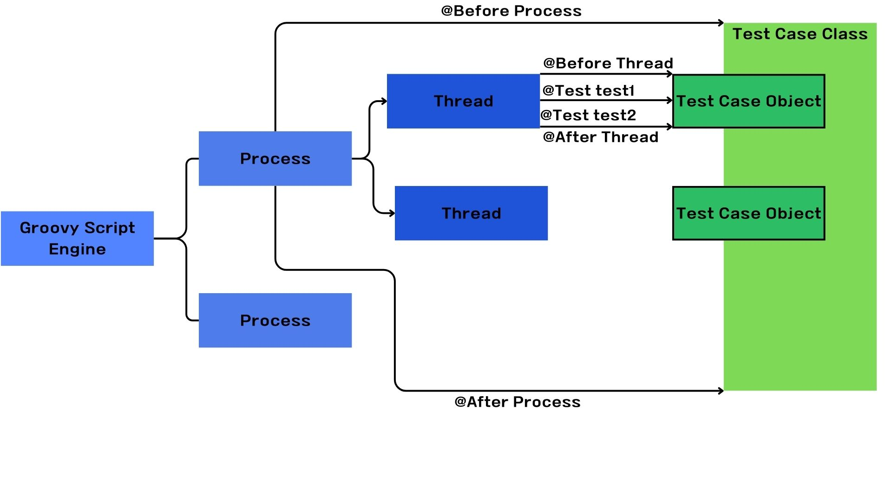

# Ngrinder문법

## nGrinder Groovy 스크립트 기본 생성 소스

```java
import static org.hamcrest.Matchers.*;
import net.grinder.plugin.http.HTTPRequest;
import net.grinder.plugin.http.HTTPPluginControl;
import net.grinder.script.GTest;
import net.grinder.script.Grinder;
import net.grinder.scriptengine.groovy.junit.GrinderRunner;
import net.grinder.scriptengine.groovy.junit.annotation.BeforeProcess;
import net.grinder.scriptengine.groovy.junit.annotation.BeforeThread;
// import static net.grinder.util.GrinderUtils.* // You can use this if you're using nGrinder after 3.2.3
import org.junit.Before;
import org.junit.BeforeClass;
import org.junit.Test;
import org.junit.runner.RunWith;
import HTTPClient.HTTPResponse;
import HTTPClient.NVPair;
/**
 * A simple example using the HTTP plugin that shows the retrieval of a
 * single page via HTTP. 
 * 
 * This script is automatically generated by ngrinder.
 * 
 * @author admin
 */
@RunWith(GrinderRunner)
class TestRunner {
	public static GTest test;
	public static HTTPRequest request;
	@BeforeProcess
	public static void beforeProcess() {
		HTTPPluginControl.getConnectionDefaults().timeout = 6000;
		test = new GTest(1, "Test1");
		request = new HTTPRequest();
		test.record(request);
		grinder.logger.info("before process.");
	}
	@BeforeThread 
	public void beforeThread() {
		grinder.statistics.delayReports=true;
		grinder.logger.info("before thread.");
	}
	@Test
	public void test(){
		HTTPResponse result = request.GET("http://please_modify_this.com");
		if (result.statusCode == 301 || result.statusCode == 302) {
			grinder.logger.warn("Warning. The response may not be correct. The response code was {}.", result.statusCode); 
		} else {
			assertThat(result.statusCode, is(200));
		}
	}
}
```

## 각 어노테이션 설명

### @RunWith()
- 스프링의 테스트 컨텍스트 프레임워크의 JUnit확장 기능 지정
- JUnit은 각각의 테스트가 독립적이므로 각 테스트 클래스마다 매번 오브젝트를 생성한다. 이 때 각 테스트 클래스를 지정한 ApplicationContext도 반복해서 생성되는 상황이 발생하는데 이를 방지하기 위한 어노테이션이다.
- ApplicationContext를 Singleton 으로 생성하여 단일 객체로 보장시켜준다.

### @Test
- @Test가 붙은 메서드는 스레드 내에서 반복 실행된다. 이때 일반적인 JUnit Assertion을 사용하여 테스트 결과를 검증할 수 있다.
- Assertion을 사용하여 문장의 참/거짓을 판단한다. 꼭 Assertion이 아니더라도 try/catcy, if/else문으로 에러 검사 기능을 처리할 수 있다. 파일을 열러고 할때 열리지 않거나, 네트워크 연결이 끊기는 현상 등의 상태를 처리할 떄 주로 사용한다.
- Assertion에 실패할 경우, 해당 스레드에서 실행한 마지막 테스트가 실패 처리된다.

### @BeforeProcess
- 프로세스가 생성될 떄 실행해야하는 동작 정의이다.
- static 메서드로 적용된다.
- 프로세스 내 스레드들이 공유할 리소스 파일등을 로드할 때 사용된다.
- GTest Instance를 정의하고, request 인스턴스를 바이트 코드 조작을 통해 레코딩하도록 한다.
- request 인스턴스에 대해 method 호출을 하게 되면 테스트 별로 TPS를 증가시킨다.

### @AfterProcess
- 프로세스가 종료하기 직전에 실행해야 하는 동작 정의
- static 메서드로 적용된다.
- 예로 입출력 닫기, 리소스파일 닫기 등을 수행한다.

### @BeforeThread
- 각 쓰레드가 실행된 전에 실행해야 하는 동작 정의를 수행한다.
- member 메서드로 적용된다.
- 테스트 대상 시스템에 로그인, 스레드 별 쿠키 핸들러 설정등에 사용된다.

### @After Thread
- 각 쓰레드가 종료하기 직전에 실행해야 하는 동작을 정의한다.
- member 메서드로 적용된다.
- 테스트 대상 시스템에 로그아웃 해야할때 수행한다.

### @Before
- 모든 @Test 메서드가 실행되기 전에 실행해야 하는 동작을 정의한다.
- member 메서드로 적용된다.
- 모든 @Test메서드가 공유하는 로직이 필요한 경우 수행


### @After
- 모든 @Test가 종료된 이후 실행해야 하는 동작
- member 메서드로 적용된다.
- 거의 사용하지 않는 편이다. 해줄게 없기 때문...?


## Grooby Script 실행 과정

